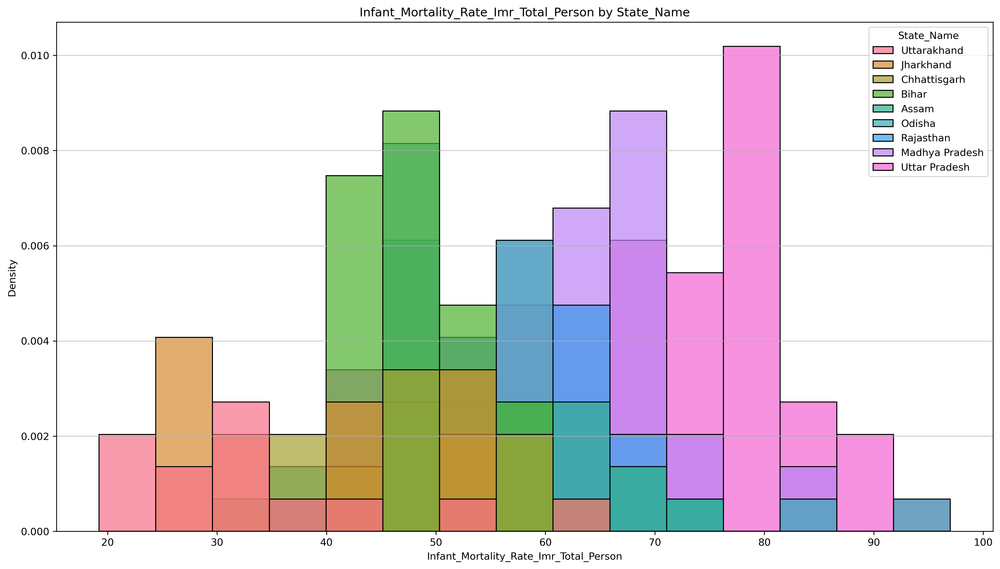
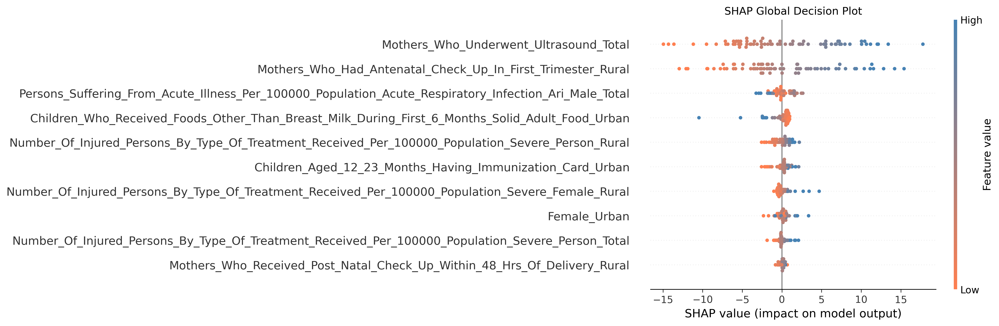
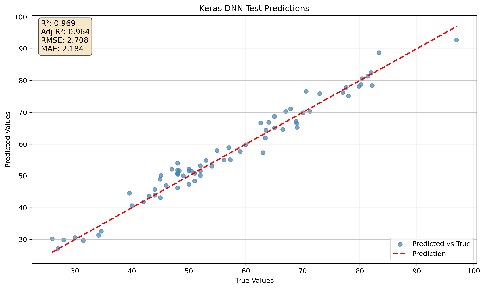
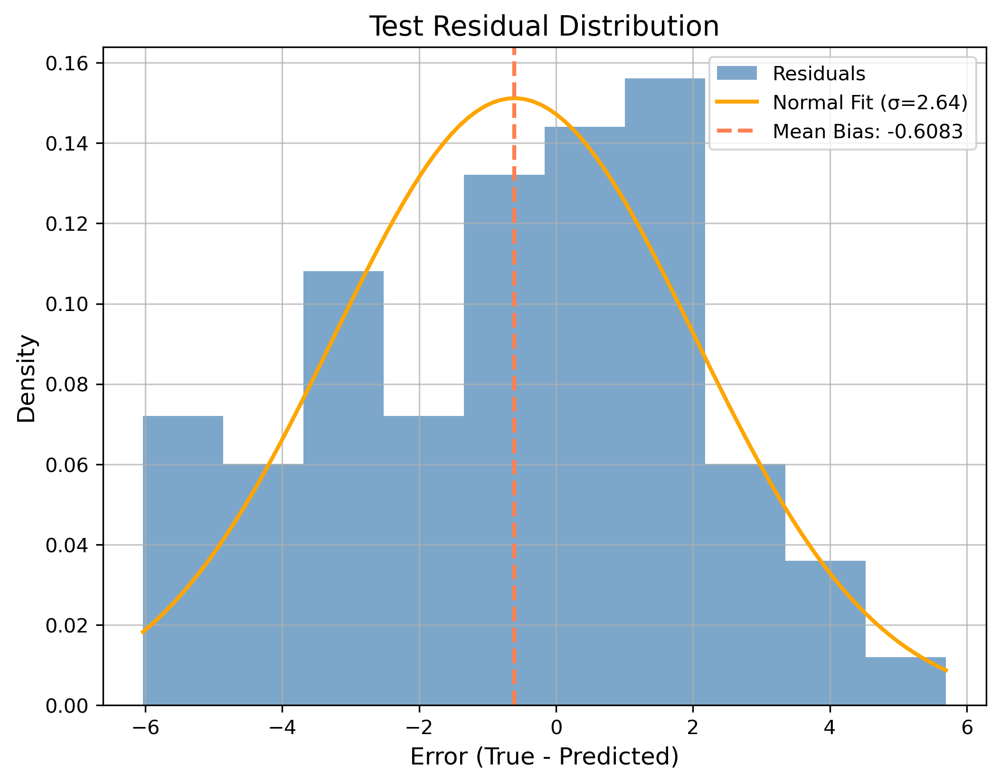

[](https://health-analytics-dashboard.streamlit.app/)
[](https://mybinder.org/v2/gh/rcghpge/capstone/main?urlpath=lab)
[](https://hub.docker.com/r/rcdpge/capstone-binder)

# Machine Learning for Health Analytics

## **DATA 4382 | University of Texas at Arlington**


Machine learning for health analytics utilizing district-level indicators. This project focuses on **Infant Mortality Rate (IMR)** as the primary target variable 
while supporting broader research areas of focus.

## Business Problem/Motivation
Public health data contain many interacting variables, including nutrition, sanitation, literacy, and demographic indicators. This project builds a reproducible 
machine learning workflow that utilizes district-level health data to predict IMR and support data-driven health analytics.

## Project Overview
This repository presents an end-to-end health analytics pipeline that includes data preprocessing, exploratory data analysis, feature selection, model training, 
evaluation, explainability, and deployment. The current implementation targets IMR as a focus in advanced analytics, but the framework is structured so the 
same development workflow can be extended to other research areas of focus..

## Data
- **Source:** Key Indicator district-wise dataset from India public health data.
- **Type:** Structured tabular dataset.
- **Unit of analysis:** District-level records.
- **Key features:** Demographic, sanitation, literacy, nutrition, and other health-related indicators.
- **Focus target:** `YY_Infant_Mortality_Rate_Imr_Total_Person`.

## Data Preprocessing
The preprocessing workflow was designed to improve data quality and reduce noise before training:
- Median imputation for numeric variables.
- Most-frequent imputation for categorical variables.
- One-hot encoding for categorical features.
- Robust scaling for numeric features.
- VIF-based pruning to reduce multicollinearity.
- RF-RFECV for feature selection.

## Exploratory Data Analysis
Exploratory analysis was used to understand data distributions, state-level variation, and feature relationships with IMR. The project includes data visualizations 
for statewise target distributions, feature-target correlations, predictive model plots, and explainability outputs.

### Example visuals



## Modeling Approach
This project compares three regression approaches:
- **Baseline model:** XGBoost
- **Prototype model:** K-Nearest Neighbors
- **Advanced model:** JAX/Keras Deep Neural Network

The XGBoost model serves as a simple baseline for structured tabular data, the KNN model was developed as a prototype model, while the neural network captures 
more complex non-linear relationships among health indicators.

## Model Training
The neural network was implemented in Keras with a JAX backend and trained using:
- **Optimizer:** Adam.
- **Loss function:** Huber loss.
- **Regularization:** Dropout and L2 regularization.
- **Training controls:** Validation split, early stopping, and learning-rate reduction.

The codebase also saves model artifacts, preprocessing objects, feature selectors, metrics, and plots for reproducibility.

## Results
Model performance was evaluated using standard regression metrics:
- **R²:** Measures how much variance in IMR is explained by the model.
- **Adjusted R²:** Similar to R², but penalizes variable complexity.
- **RMSE:** Measures average prediction error with stronger penalties for larger errors.
- **MAE:** Measures the average absolute difference between predicted and actual IMR.

### Model comparison
| Model | Split | R² | Adjusted R² | RMSE | MAE |
|-------|-------|----|-------------|------|-----|
| XGBoost Baseline | Test | 0.9845 | 1.0015 | 1.9861 | 1.0045 |
| K-Nearest Neighbors | Test | 0.9936 | 0.9930 | 1.2581 | 0.7158 |
| Keras Deep Neural Network | Test | 0.9694 | 0.9643 | 2.7082 | 2.1835 |

### Advanced analytics



## Model Interpretation
Interpretability is an important part of this project because health analytics requires more than just predictive accuracy. The repository includes:
- Feature importance analysis.
- SHAP global and local explanations.
- LIME local explanations.
- Residual and outlier diagnostics.

These methods help explain which health indicators contribute most to predicted IMR values and how individual district-level predictions are influenced by 
specific variables.

## Key Insights
- **Feature selection improved model quality:** VIF pruning and RF-RFECV reduced redundant or highly collinear features, helping create a cleaner and more stable 
input set for modeling.
- **District-level health indicators contain meaningful predictive signal:** The models were able to explain a substantial share of variation in IMR utilizing 
public health, demographic, and sanitation-related features.
- **Explainability adds practical value:** SHAP and LIME outputs provide insights into which factors are most associated with higher or lower predicted 
IMR, supporting interpretation beyond raw performance metrics.

## Real-World Impact
This project demonstrates how machine learning can support health analytics by identifying patterns in district-level public health data and estimating outcomes 
such as IMR. In practice, a workflow like this could help analysts, policymakers, or public health organizations prioritize intervention areas, allocate 
resources more effectively, and better understand the indicators associated with elevated health risk.

## Conclusion
This repository contributes toward health analytics research for machine learning, explainability, and cloud-based deployments. Although IMR is the 
current focus variable, the framework is structured to support other fields of study in future work.

## Future Work
Potential next steps include:
- Extending this research to other research areas of focus.
- Comparing more model families and ensemble approaches.
- Incorporating additional data or longitudinal features.
- Improving technologies in this space for  commercial-grade technologies.
- Advanced data science research.

## How to Run
### 1. Clone the repository
```bash
git clone https://github.com/rcghpge/capstone.git
cd capstone
```

### 2. Create and activate a virtual environment
```bash
python -m venv venv
source venv/bin/activate
```

### 3. Install dependencies
```bash
pip install -e .[dev]
```

### 4. Run the model pipeline
```bash
python keras_dnn.py --data data/Key_indicator_districtwise.csv --target YY_Infant_Mortality_Rate_Imr_Total_Person
```

### 5. Launch the Streamlit app
```bash
streamlit run app.py
```

### 6. Open notebooks
```bash
jupyter notebook notebooks/
```

### Optional environments
- **Binder:** https://mybinder.org/v2/gh/rcghpge/capstone/main?urlpath=lab
- **Docker:** `docker run -p 8888:8888 rcdpge/capstone-binder:latest`

## Repository Structure
```bash
.
├── .devcontainer/          # VS Code development container configuration
├── .github/                # GitHub Actions and workflow files
├── assets/                 # Images, badges, and static project assets
├── binder/                 # Binder environment configuration
├── models/                 # Model code, saved models, and related artifacts
├── notebooks/              # Jupyter notebooks for research, EDA, and workflows 
├── pixi/                   # Pixi environment setup files
├── .dockerignore           # Files excluded from Docker builds
├── .gitattributes          # Git attribute configuration
├── .gitignore              # Git ignore rules
├── CITATION.cff            # Citation metadata for the repository
├── Dockerfile              # Docker image build instructions
├── LICENSE                 # Project license
├── README.md               # Project documentation
├── __init__.py             # Package initialization file
├── app.py                  # Streamlit application entry point
├── pixi.lock               # Pixi lock file
├── pyproject.toml          # Python project configuration
└── requirements.txt        # Python package dependencies
```


## Requirements
Install project dependencies with:

```bash
pip install -e .[dev]
```

## Pixi for Data Science:
```bash
# Pixi
./pixi/install/install.sh
source ~/.bashrc

pixi shell
pixi info
```

---

## License

This project is licensed under the MIT License.

---
